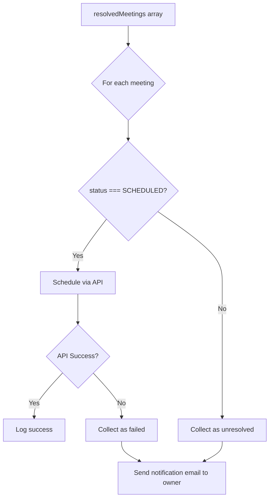

# Send Emails for Unresolved Meetings

## Context

The `resolveMeetingConflicts` function in [`resolveMeetingConflicts.ts`](packages/agents/vickie-bennie/src/lib/resolveMeetingConflicts.ts) currently reschedules meetings but does not notify users when meetings cannot be rescheduled. Meetings can fail to reschedule for two reasons:

1. **Algorithm failure**: No available time slot found (`status === 'UNRESOLVED'`)
2. **API failure**: The `scheduleMeeting` call throws an error

## Data Flow



## Implementation

### 1. Modify scheduling loop to track failures

Wrap the `scheduleMeeting` call in a try-catch and collect failed meetings alongside unresolved ones:

```typescript
const failedMeetings: Array<ResolvedMeeting & { reason: string }> = [];

for (const meeting of resolvedMeetings) {
  if (meeting.status === 'SCHEDULED' && meeting.rescheduledTo) {
    try {
      await officeServiceV3.scheduleMeeting({...});
    } catch (error) {
      failedMeetings.push({
        ...meeting,
        reason: `Failed to schedule: ${(error as Error).message}`,
      });
    }
  } else {
    failedMeetings.push({
      ...meeting,
      reason: 'No available time slot found',
    });
  }
}
```

### 2. Create email template helper function

Add a helper function to generate the email body from the failed meeting data:

```typescript
function buildUnresolvedMeetingEmailBody(
  meetings: Array<ResolvedMeeting & { reason: string }>
): string {
  const meetingList = meetings
    .map(m => `- "${m.subject}" (${m.start}): ${m.reason}`)
    .join('\n');
  
  return `The following meetings could not be rescheduled:\n\n${meetingList}\n\nPlease review and reschedule manually.`;
}
```

### 3. Send notification email to meeting owner

After the scheduling loop, if there are failed meetings, send a single consolidated email to the owner using `OfficeService.sendEmail`:

```typescript
if (failedMeetings.length > 0) {
  const officeService = await container.getAsync<OfficeService>(TYPES.OfficeService);
  const ownerEmail = failedMeetings[0].email; // All meetings belong to same owner
  
  await officeService.sendEmail({
    from: process.env.OFFICE_SERVICE_ACCOUNT,
    recipients: [ownerEmail],
    subject: 'Meeting Conflict Resolution - Action Required',
    message: buildUnresolvedMeetingEmailBody(failedMeetings),
  });
}
```

## Files to Modify

| File | Changes |

|------|---------|

| [`resolveMeetingConflicts.ts`](packages/agents/vickie-bennie/src/lib/resolveMeetingConflicts.ts) | Add imports (`OfficeService`), add `buildUnresolvedMeetingEmailBody` helper, modify scheduling loop to track failures, add email sending logic |

## Imports to Add

```typescript
import { OfficeService } from '@codestrap/developer-foundations-types';
```